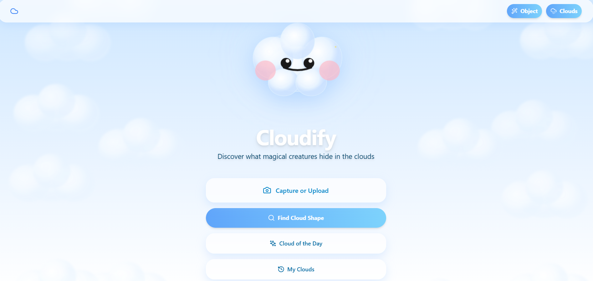
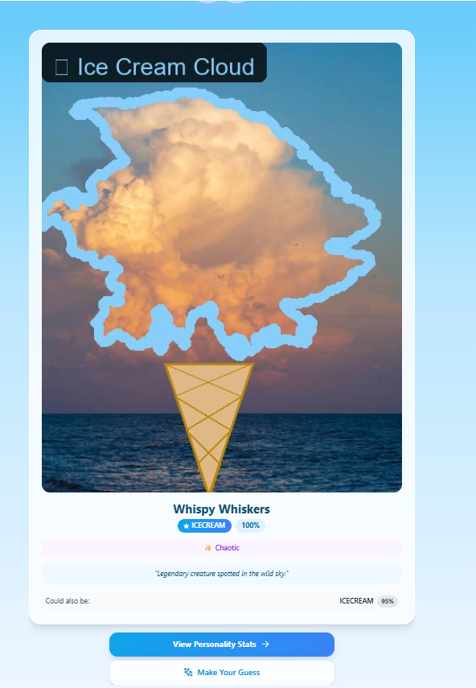
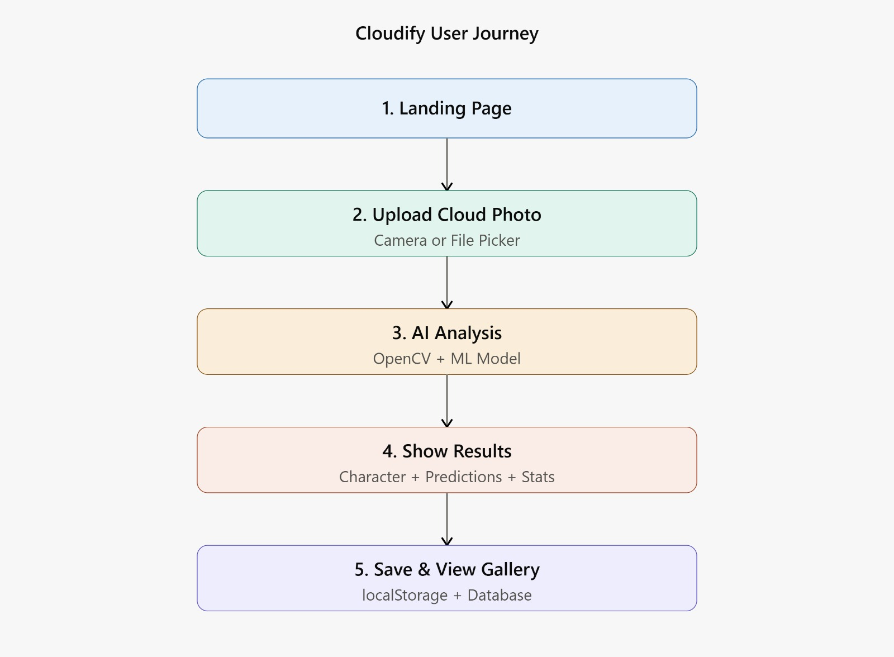

# Cloudify🎯

## Basic Details
### Team Name: Swaria

### Team Members
- Team Lead: Swathi H Nair - TIST
- Member 2: Maria Anna Vibin - TIST

### Project Description
Cloudify is an interactive web app that uses computer vision and CLIP AI to analyze cloud photos and tell you what objects they resemble. Upload a cloud image, and the app detects the cloud shapes, classifies them, and creates a fun, gamified experience with features like "Human vs AI" matching games, cloud hunting mode, and personality stats based on your cloud interpretations.

### The Problem (that doesn't exist)
Have you ever looked up at the sky and gotten into heated debates with friends about whether that cloud looks like a bunny or a spaceship? Are you tired of losing arguments because you can't prove that fluffy cumulus is definitely an ice cream cone? Does the existential dread of clouds floating by without anyone acknowledging what they look like keep you up at night? We've identified a critical gap in human civilization: no one is properly documenting and validating what random clouds look like, and there's absolutely no AI referee to settle cloud shape disputes.

### The Solution (that nobody asked for)
Introducing Cloudify - the app that settles all your cloud-related existential crises! We've trained an AI to be the ultimate cloud shape referee, using CLIP technology to analyze your cloud photos and tell you exactly what object they resemble. But wait, there's more! You can challenge the AI in "Human vs AI" showdowns, hunt for specific cloud shapes like a Pokémon trainer ("Gotta spot 'em all!"), and build a personality profile based on your cloud interpretations. Complete with a cute flying mascot, gamification features, and a history tracker because clearly, your cloud-spotting achievements deserve to be immortalized. Finally, you can prove to everyone that you're either a cloud-seeing genius or delightfully delusional - with receipts!

## Technical Details
### Technologies/Components Used
For Software:
- Languages:
Python 3.x
JavaScript (ES6+)
HTML5/CSS3

- Frameworks:
FastAPI (Backend REST API)
React 18.2.0 (Frontend UI)
Vite 5.0 (Build tool & dev server)
Tailwind CSS 3.3 (Styling)

-Libraries:
Backend:
Transformers 4.35+ (Hugging Face - CLIP model)
PyTorch 2.0+ (Deep learning)
SQLAlchemy 2.0 (Database ORM)
Pillow 10.0+ (Image processing)
NumPy & SciPy (Scientific computing)
Uvicorn (ASGI server)
Frontend:
Framer Motion 10.16 (Animations)
Axios 1.6 (HTTP requests)
React Router DOM 6.20 (Routing)
Lucide React (Icons)
Canvas Confetti (Celebration effects)
html-to-image (Screenshot generation)

-Tools:
CLIP (Contrastive Language-Image Pre-training) AI model
SQLite (Database)
Git (Version control)
Node.js & npm (Package management)

### Implementation
For Software:
# Installation
-Clone the repository:
 git clone <repository-url>
 cd cloudify
-Backend Setup
 cd backend
 pip install -r requirements.txt
-Frontend Setup
 cd ../frontend
 npm install

# Run
Terminal 1 - Start Backend Server
cd backend
python main.py
Backend runs on http://localhost:8000

Terminal 2 - Start Frontend Development Server
cd frontend
npm run dev
Frontend runs on http://localhost:5173

### Project Documentation
For Software:

# Screenshots (Add at least 3)

*Landing Page - Cloudify's welcoming interface with the cute cloud mascot*

*Cloud photo capture interface where users can upload or take pictures of clouds to begin the magical analysis journey*

*AI-powered cloud analysis in action - showing the detected cloud shape with confidence scores, personality traits, and the fun character name generated for your cloud*

*The hunting mode feature actively searching for specific cloud shapes that users want to find in their photos*

*Successfully found the searched object in sky*

# Diagrams

*Cloudify's complete user journey: Starting from the landing page, users upload cloud photos which are analyzed by the AI using CLIP and OpenCV models. The system generates character names, predictions, and personality stats, which are then displayed with fun animations. Finally, results are saved to the database and accessible in the cloud history gallery*

### Project Demo
# Video
https://drive.google.com/file/d/1a0d-gaRFfRUQPK5Koi3k91d21CHfwCHU/view?usp=sharing
*Cloudify is a playful web application that uses AI to solve a problem nobody asked for: determining what objects clouds look like. Users upload photos of clouds, and the app uses advanced computer vision (CLIP AI model and object detection) to analyze and classify the shapes, telling you whether your cloud looks like an ice cream cone, a bunny, a spaceship, or one of 50+ other objects.*

## Team Contributions
- Maria Anna Vibin: Frontend development
- Swathi H Nair: Backend Development

---
Made with ❤️ at TinkerHub Useless Projects 

